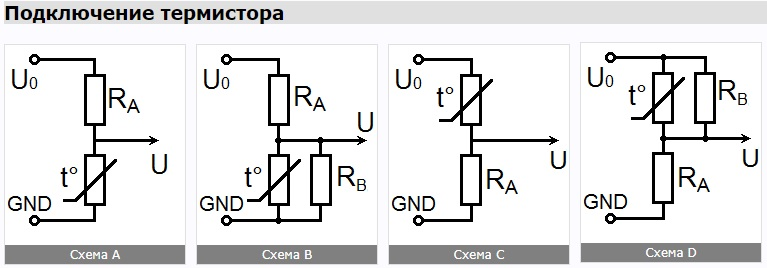

# Измерение температуры при помощи NTC термистора и микроконтроллера

Одним из вариантов для измерения температуры является использование термисторов. Среди преимуществ термистора можно выделить большое значение температурного коэффициента, то есть значительное изменение сопротивления в зависимости от температуры (порядка 2-10% на Кельвин). Термисторы бывают двух типов: с положительным температурным коэффициентом (PTC, Positive Temperature Coefficient), то есть увеличивающие своё сопротивление с увеличением температуры, и с отрицательным (NTC, Negative Temperature Coefficient) – уменьшающие сопротивление с возрастанием температуры. Речь в данной статье пойдёт про вторые, и про их использования для измерения температуры в сочетании с микроконтроллерами

# Характеристика NTC термистора

Термисторы характеризуются рядом параметров, такими, как максимальный допустимый ток, точность, сопротивление при определённой температуре (как правило, при 25°С). Одним из параметров, характеризующим степень изменения сопротивления в зависимости от температуры является **коэффициент температурной чувствительности**, обозначаемый **B**. Этот коэффициент рассчитывается на основе значений сопротивления при двух конкретных значениях температур. Во многих случаях этими температурами выбираются 25°С и 100°С. Обычно температуры, использованные при вычислении коэффициента указываются после буквы, например **B25/100**. Коэффициент B измеряется в Кельвинах и вычисляется по следующей формуле:

    B = (ln(R1) – ln(R2)) / (1 / T1 - 1 / T2)    [1]

где R1 и R2 - значения сопротивлений при температурах соответственно T1 и T2, выраженных в Кельвинах.

Из этой формулы следуют и обратные:

    R1 = R2 * e^(B * (1 / T1 - 1 / T2))    [2]

    T1 = 1 / ((ln(R1) – ln(R2)) / B + 1 / T2)    [3]

# Вычисление температуры

Термисторы обладают высокой степенью нелинейности параметров, и термисторы различных моделей, даже при одинаковых значениях параметра B25/100 могут по разному изменять сопротивление в зависимости от температуры. Поэтому формула [3] может лишь приблизительно оценить температуру. Кроме того, такая формула подразумевает сложные вычисления, которые требуют много процессорного времени, что часто является неприемлемым. Более простым и эффективным подходом является хранение таблицы, в которую заносятся предварительно рассчитанные значения, возвращаемые АЦП при тех, или иных температурах. Для экономии памяти можно хранить значения только для некоторых точек, искать их в таблице двоичным поиском, а промежуточные значения получать линейной интерполяцией. Для измерений температуры окружающего воздуха с точностью до 0.3°C, достаточно хранить значения с шагом 5°C. Если значения лежат в пределах 16 бит (и занимают 2 байта), то для хранения такой таблицы для диапазона измеряемых температур от -30 до 70 градусов потребуется всего 40 байт. Точность измерений можно повысить, уменьшив шаг таблицы. Так при шаге 2°C можно добиться точности до 0.1°C на широком диапазоне измерений.

Производители термисторов, как правило, приводят таблицы показывающие изменение сопротивления в зависимости от температур. Значения в этих таблицах также привязаны к сетке температур с некоторым шагом (например, 5°C). Используя формулы [1] и [2] можно с достаточной точностью интерполировать табличные значения.

# Схемы подключения

Наиболее простым вариантом подключения является схема A. При выборе номинала резистора RA примерно равным сопротивлению термистора в районе измеряемых температур, значения U будут изменяться ближе к линейным, что обеспечит большую точность при интерполяции табличных значений.

Выбирая номиналы RA и термистора, следует учесть, что протекающий через термистор ток вызывает его нагрев и, как следствие, искажение показаний. Желательно чтобы мощность на термисторе не превышала 1 мВт. А значит, при напряжении U0 = 5В, RA должен быть как минимум, 10 килоОм. Сопротивление термистора в измеряемом диапазоне должно иметь примерно тот же порядок.

Схема B призвана ограничить мощность, рассеиваемую на термисторе.

Схемы C и D являются обратными к A и B. Их имеет смысл использовать, если требуется измерять низкие температуры, когда референтное значение АЦП (Uref) ниже U0.

# Подключение к АЦП микроконтроллера

У большинства контроллеров для снижения шумов используется отдельная линия питания для модуля АЦП. Инструкция рекомендует подключать эти входы через фильтр: индуктивность L = 10мкГн, и конденсатор C2 = 0,1мкФ.

Микроконтроллер может использовать либо внешнее референтное напряжение для АЦП, либо внутреннее (2,56В или 1,1В), либо, в качестве такового, использовать напряжение питания АЦП: AVCC. При использовании внешнего напряжения, оно должно быть подано на вход AREF. При использовании AVCC, или внутреннего напряжения 2,56В, между этим входом и землёй должен быть размещён конденсатор (на схеме C1). Инструкция не даёт чёткого указания для выбора ёмкости конденсатора, рекомендую использовать керамический конденсатор 0,1мкФ и более.

Для снижения измеряемых шумов, рекомендую термистор также подключать к фильтрованному напряжению параллельно AVCC, и настроить на использование этого напряжения в качестве референтного.

Дополнительно, для подавления шумов возникающих на линиях, можно установить конденсатор C3 в диапазоне 1-100нФ.

Следует учесть, что помимо модуля АЦП, вход AVCC запитывает также некоторые из портов ввода/вывода (как правило, на тех же выводах, что используются для АЦП). Использование этих портов на вывод и подключение к ним нагрузки может создать дополнительные шумы в работе АЦП.

Чтобы нивелировать шумы, возникающие на АЦП, рекомендую провести замеры несколько раз подряд и просуммировать полученные значения. В микроконтроллерах ATmega АЦП – 10-разрядный. Просуммировав результаты 64 подряд идущих измерений, результат остаётся в пределах 16-битного беззнакового целого, что не потребует дополнительной памяти для сохранения таблицы значений. При большем числе измерений также можно оставаться в пределах 16 бит, соответствующим образом сдвигая или деля результат.

# Расчёт таблицы значений

Вашему вниманию предлагаю скрипт для онлайн расчёта таблицы значений АЦП.

Расчёт значений ведётся либо по двум значениям температур и сопротивлений, либо вводится списком, либо используется одна из предзагруженных R/T характеристик. В настоящее время загружены R/T характеристики термисторов фирмы Siemens/EPCOS. Выберите подходящую из списка.

Загруженные характеристики даны с шагом 5°С, при выборе меньшего шага сетки, значения получаются путём интерполяции по формулам [1] и [2] двух ближайших значений из таблицы.

При построении таблицы автоматически соответствующим образом обновляется пример исходного кода под ней.

**Внимание!**Так как параметры термисторов в значительной мере нелинейны, расчёт по двум значениям сопротивлений, либо по значению и коэффициенту будет очень приблизительным. Вычисленное значение температуры при измерении высоких, или низких температур в таком случае может значительно (на десятки градусов) отличаться от актуальной.

Чтобы узнать подходящий тип R/T характеристики для вашего термистора, скачайте документацию, данную заводом изготовителем.